# Reverse an Array
Given an array of numbers, reverse the array without using any built-in methods meant for that purpose.

## Challenge
Write a function called reverseArray which takes an array as an argument. Without utilizing any of the built-in methods available to your language, return an array with elements in reversed order.

## Approach & Efficiency
I set up an empty array (reversedArray) and then set up a for loop iterating over every index position of the original array beginning with the last one.  For each index position I pushed the value of the original array into the new array, resulting in a revered order of the same values.

## Solution
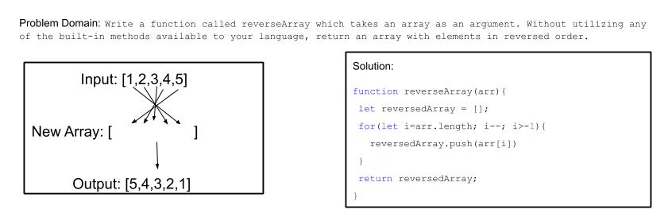

---

# Insert Shift Array
Given an array of numbers and a value, add the value to the center of the array without using any built-in methods meant for that purpose.

## Challenge
Write a function called insertShiftArray which takes in an array and the value to be added. Without utilizing any of the built-in methods available to your language, return an array with the new value added at the middle index

## Approach & Efficiency
First I set a variable to the midpoint by dividing the length of the array in two and rounding the return.  Then I created an empty array (newArray).
Next I did an initial for loop with a maximum value of i equal to the midpoint.  Using that loop, I pushed the first half of the initial array into the new array.
Once that was complete, I pushed the value provided into the new array.
Finally I did another for loop, this time with an initial i value equal to the midpoint and a maximum value of the length of the array.  Using this loop, I pushed the remaining values from the original array into the new array.
This way the new value will always be nested in the center of the array and no values will be lost.  The method works for both even and odd length arrays.

## Solution
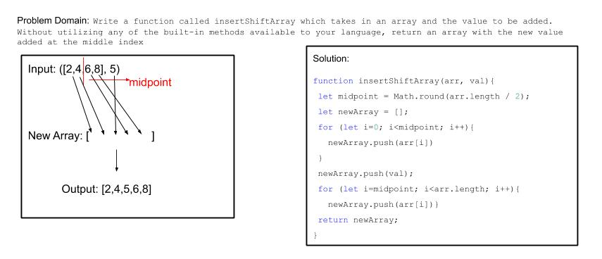

---

# Array Binary Search
Given a sorted array of numbers and a value, determine if that value is within the array using a binary search.  If the value is in the array, return the index position of the value.  If the value is not in the array, return -1.

## Challenge
Write a function called BinarySearch which takes in 2 parameters: a sorted array and the search key. Without utilizing any of the built-in methods available to your language, return the index of the array’s element that is equal to the search key, or -1 if the element does not exist.

## Approach & Efficiency

Set a midpoint variable equal to the ‘middle index’
Compare search key to value of array at midpoint index
IF they are equal, return midpoint index
IF the key value is > the array value at midpoint index, redefine the midpoint based on the remaining array values greater than the midpoint and recheck for a match
IF the key value is < the array value at midpoint index, redefine the midpoint based on the remaining array values less than the midpoint and recheck for a match
This loop should be able to continue until either:
The key matches a midpoint and an index is returned OR
A midpoint does not exist (indicating all values have been checked) and a -1 is returned

## Solution
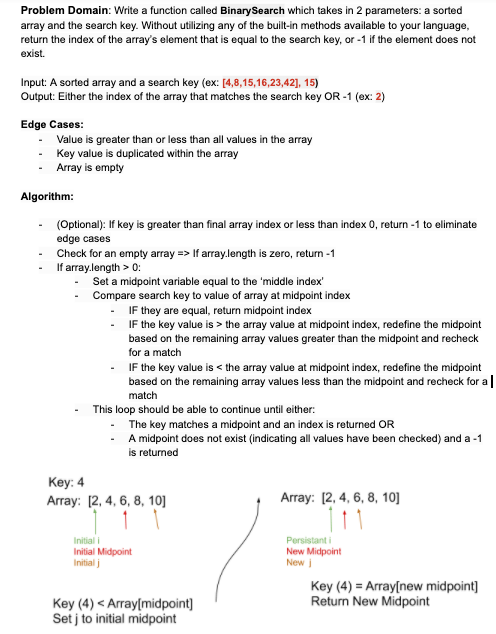

---

# Singly Linked List
Create a Node class capable of generating a singly linked list that includes methods to insert a new node at the head, check for values present in the list, and return a string of all values in the list per specific formatting instructions.

## Challenge

* Create a Node class that has properties for the value stored in the Node, and a pointer to the next Node.
* Within your LinkedList class, include a head property. Upon instantiation, an empty Linked List should be created.
* Define a method called insert which takes any value as an argument and adds a new node with that value to the head of the list with an O(1) Time performance.
* Define a method called includes which takes any value as an argument and returns a boolean result depending on whether that value exists as a Node’s value somewhere within the list.
* Define a method called toString which takes in no arguments and returns a string representing all the values in the Linked List, formatted as:
"{ a } -> { b } -> { c } -> NULL"

## Approach & Efficiency

LinkedList builds off of a Node class by creating new instances of Node that can be either prepended (with insert()) or appended(with append()).  The insert() method has an O value of 1 in that it functions the same way no matter how long the string may be.  Append() and toString() have an O value of n because both needs to traverse the full length of the list before the function can be completed.  Similarly, includes() has a maximum O value of n because if the value does not exist or exists in the final node, the full list will need to be traversed.

## API

* insert() takes in a value and inserts a new node at the head of the list containing that value

* append() takes in a value and inserts a new node at the end of the list containing that value

* includes() takes in a value and traverses the list, checking for that value at each node.  If the value is found, a boolean of true is returned, else a boolean of false is returned

* toString() returns a string containing all values in the list in the order that they are found, ending in NULL to indicate the end of the list

---

# Linked List - Extended Classes
Add new methods to our linked list class to allow for more functionality

## Challenge
Create 3 new methods for the linked list class begun on Friday:
* .append(value) should add a new node with the given value to the end of the list
  - Note: .append() method was covered in class with JB => whiteboard will focus on the two new methods
* .insertBefore(value, newVal) should add a new node with the given newVal immediately before the node with the value of value
* .insertAfter(value, newVal) should add a new node with the given newVal immediately after the node with the value of value

## Approach & Efficiency

**.insertBefore():**
* First check for an empty list
  - If list is empty, console log that list is currently empty and will be instantiated with newVal
* If the list is not empty, confirm that the target value is included in the list by calling our includes(value) function
  - This makes our method less efficient but does prevent future errors => room for improvement in later iterations?
  - If the includes() method returns false, console log the error and stop here.
* If includes(value) returns true, create a currentNode variable and set it equal to the head node to begin our search
* Check to see if the value of that initial currentNode is equal to our target value
  - If it is, we are going to essentially treat this as an ‘insert’ method as the newVal will need to be set as the new head of the list and nothing else will change in a singly linked list
  - If it is NOT, then we can enter a while loop to traverse our list
    - Within the while loop, we will be checking the value of the NEXT node against our target value
    - When the value of the next node equals our target value, we need to
      - Set the ‘next’ value of our new node to point at the same value as the current node’s ‘next’ value
      - Then, change the current node’s ‘next’ value to point at our new node.

**.insertAfter():**
* First check for an empty list
  - If list is empty, console log that list is currently empty and will be instantiated with newVal
* If the list is not empty, confirm that the target value is included in the list by calling our includes(value) function
  - This makes our method less efficient but does prevent future errors => room for improvement in later iterations?
  - If the includes() method returns false, console log the error and stop here.
* If includes(value) returns true, create a currentNode variable and set it equal to the head node to begin our search
* Begin a while loop to traverse our list
  - Within the while loop, we will be checking the value of the CURRENT node against our target value
  - When the value of the current node equals our target value, we need to:
    - Set the ‘next’ value of our new node to point at the same value as the current node’s ‘next’ value
    - Then, change the current node’s ‘next’ value to point at our new node.
* If we  traverse the full list and exit the while loop, we will still need to check against the last iteration of the ‘currentNode’ for our target value, performing the above actions if the value matches our target value

**Big O** should be 2n where n is the number of nodes currently in the list (n for the initial includes() check, and up to n for the insert method to traverse the list as far as the target node.

## Solution

---

# Linked List - Extended Classes
Add a new linked list method that returns the value of a node 'k' away from the end of the list.

## Challenge
Write a method for the Linked List class which takes a number, k, as a parameter. Return the node’s value that is k from the end of the linked list. You have access to the Node class and all the properties on the Linked List class as well as the methods created in previous challenges.

## Approach & Efficiency

* First check for an empty list
  - If list is empty, console log that list is currently empty and stop here.
* Then confirm that the provided value of k is not a negative integer
  - If it IS a negative integer, console log that k is invalid and stop here.
* Once we've established a valid list and k value, we can declare a variable listLength that is set to zero and set the currentNode variable to this.head (the beginning of our list).
* Begin a while loop that will traverse the full length of the list, adding to the listLength every time it moves from node to node
  - Because we want to return the value of the LAST node when entering a k value of 0, we will use array logic for the listLength so that a list with 1 node would return a listLength of 0
* After establishing the listLength, we will calculate a targetNode by subtracting k from the listLength (ie figure out the 'index' of k from the end)
  - If the calculated targetNode is less than zero, return an Exception and stop here.  The k value is invalid because not enough nodes exist to meet the parameters.
* Assuming a valid targetNode value we will reset the current node to this.head and set up a new counter that is set to zero (kCounter)
* Next, we will set up a new while loop that will run while kcounter is less than the targetNode (i.e. we're going to count UP to the correct 'index'), stepping through each node in the list
  - Whenever the kCounter reaches the targetNode, we will break out of our while loop, leaving currentNode set to our target of k before the end
  - Finally, we can return the value of the current node
  - In the case of the targetNode being zero, this second while loop will never be entered and the value of the head will be correctly returned

**Big O** should be 2n where n is the number of nodes currently in the list (n for the initial traversal to establish the length of the list, and up to n for the kthFromEnd method to traverse the list as far as the target node and return that value.

## Solution
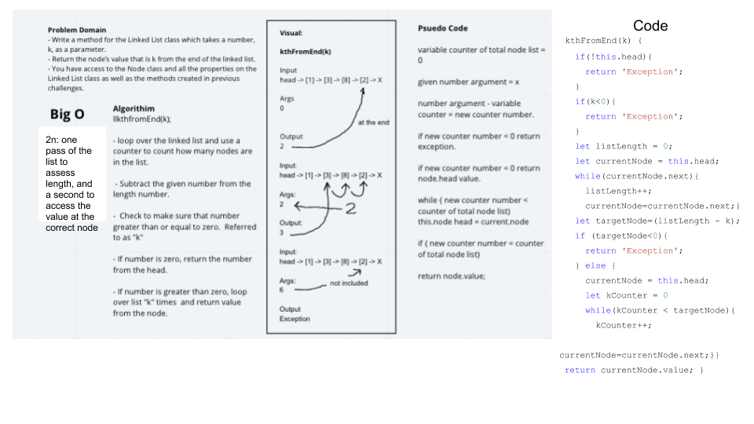

---

# Linked List - Extended Classes
Create a function called zipLists which takes in two linked lists and merges them in a zipperlike fashion, returning a reference to the head of the zipped list.

## Challenge
Write a function called zipLists which takes two linked lists as arguments. Zip the two linked lists together into one so that the nodes alternate between the two lists and return a reference to the head of the zipped list. Try and keep additional space down to O(1). You have access to the Node class and all the properties on the Linked List class as well as the methods created in previous challenges.

## Approach & Efficiency

* Begin by establishing that the provided arguments are viable (2 non-empty lists)
* Establish variables current1 and current2 at the heads of list1 and list2, respectively
  - Confirm that at least one list has more than one node
    - If neither list has more than one node, set current1.next to current2 and stop here
* Enter a while loop that will persist while both current1 AND current2 are not undefined:
  - Establish a variable hold1 and set it equal to current1.next
  - Reassign current1.next to point to current2
  - Establish a variable hold2 and set it equal to current2.next
  - Reassign current2.next to point to current1
    - If hold1 is undefined (meaning that we’ve reached the end of list1), then current2.next should maintain its current reference in case we have not reached the end of the 2nd list
  - Reassign current1 to hold1
  - Reassign current2 to hold2
* Once we exit the while loop, our lists should be zipped.  Return a reference to list1.head (the head of the newly zipped list)

**Big O**

* Time: O(n), where n = the combined length of both lists, as each will be traversed once
* Space: O(1), because we are reassigning next values rather than creating a new list, no additional space is required

## Solution
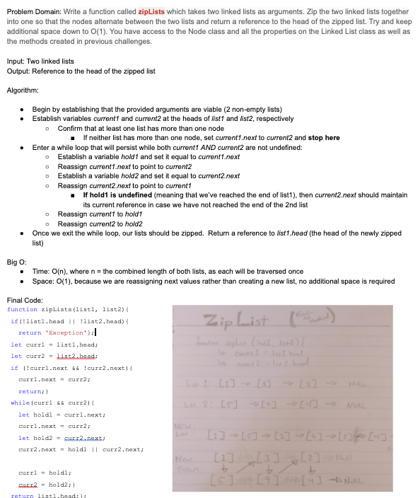

---

# Stacks and Queues
Create a Stack class and a Queue class, each with 4 specifically defined methods.

## Challenge

* Create a Node class that has properties for the value stored in the Node, and a pointer to the next node.
* Create a Stack class that has a top property. It creates an empty Stack when instantiated.
  - This object should be aware of a default empty value assigned to top when the stack is created.
  - Define a method called push which takes any value as an argument and adds a new node with that value to the top of the stack with an O(1) Time performance.
  - Define a method called pop that does not take any argument, removes the node from the top of the stack, and returns the node’s value.
    - Should raise exception when called on empty stack
  - Define a method called peek that does not take an argument and returns the value of the node located on top of the stack, without removing it from the stack.
    - Should raise exception when called on empty stack
  - Define a method called isEmpty that takes no argument, and returns a boolean indicating whether or not the stack is empty.
* Create a Queue class that has a front property. It creates an empty Queue when instantiated.
  - This object should be aware of a default empty value assigned to front when the queue is created.
  - Define a method called enqueue which takes any value as an argument and adds a new node with that value to the back of the queue with an O(1) Time performance.
  - Define a method called dequeue that does not take any argument, removes the node from the front of the queue, and returns the node’s value.
    - Should raise exception when called on empty queue
  - Define a method called peek that does not take an argument and returns the value of the node located in the front of the queue, without removing it from the queue.
    - Should raise exception when called on empty queue
  - Define a method called isEmpty that takes no argument, and returns a boolean indicating whether or not the queue is empty.

## Approach & Efficiency

All methods are an efficiency of O(1) because no traversal of the list is necessary to perform an action

The primary difference between the Stack methods and Queue methods can be understood by recognizing that Stacks follow the methodology of FILO and LIFO, while Queues follow the methodology of FIFO and LILO.

## API

**Stack Class**

- push(value) takes any value as an argument and adds a new node with that value to the top of the stack with an O(1) Time performance.

- pop() does not take any argument, removes the node from the top of the stack, and returns the node’s value.  It should raise exception when called on an empty stack.

- peek() does not take an argument and returns the value of the node located on top of the stack, without removing it from the stack.  It should raise exception when called on an empty stack.

- isEmpty() takes no argument, and returns a boolean indicating whether or not the stack is empty

**Queue Class**

- enqueue(value) takes any value as an argument and adds a new node with that value to the back of the queue with an O(1) Time performance.

- dequeue() does not take any argument.  It removes the node from the front of the queue and returns the node’s value.  It should raise exception when called on an empty queue

- peek() does not take an argument and returns the value of the node located in the front of the queue without removing it from the queue.  It should raise exception when called on an empty queue

- isEmpty() takes no argument, and returns a boolean indicating whether or not the queue is empty.

---

# PseudoQueue
Create a PseudoQueue class with two methods - enqueue & dequeue.

## Challenge

Create a brand new PseudoQueue class. 
* Do not use an existing Queue. 
* Instead, this PseudoQueue class will implement our standard queue interface (the two methods listed below), but will internally only utilize 2 Stack objects. 
* Ensure that you create your class with the following methods:
    - *enqueue(value)* which inserts value into the PseudoQueue, using a first-in, first-out approach.
    - *dequeue()* which extracts a value from the PseudoQueue, using a first-in, first-out approach.

## Approach & Efficiency

*Enqueue*  
* Use *push* method from List to push(value) to stack1

*Dequeue*  
* Check stack1.top to confirm that the queue is not empty
  - If it IS empty, return an exception and STOP HERE
* Set a currentNode to stack1.top
* Begin a while loop that will run while stack1 contains any nodes
  - shift currentNode to currentNode.next
  - Use *pop* method from List to remove top node from stack1 AND AT THE SAME TIME use the returned value from *pop* to *push* that value into stack1
* After this loop has ended, we can now *pop* the top value from stack2 and save the returned value to a variable (returnValue).  This value *should* have formerly been at the bottom of stack1, aka the head of the queue
* In order to reset our stack:
  - Reset currentNode to stack2.top
  - Begin another while loop that will run while stack2 contains any nodes
    - shift currentNode to currentNode.next
    - use the same push(pop()) combo method to shift values back from stack2 to stack1
* Once the second loop has ended and our stacks are reset, we can return the saved returnValue value

**Big O**  

*Enqueue*
* Time: O(1) - consistent regardless of queue length
* Space: O(n) - one new node will be added to the total space used

*Dequeue*
* Time: O(n) - where n = the length of the list, which will be traversed twice as all nodes are shifted from list1 to list2 and back
* Space: O(1) - one node will be removed from the total space used 

## Solution
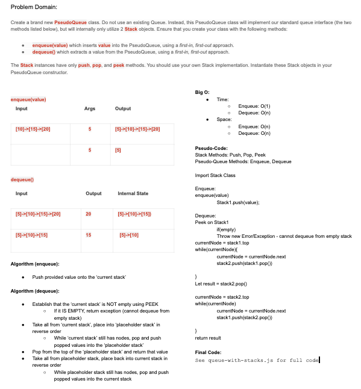

---

# AnimalShelter Queue
Create a .

## Challenge

Create a class called AnimalShelter which holds only dogs and cats. 
* The shelter operates using a first-in, first-out approach.
* Implement the following methods:
    - enqueue(animal): adds animal to the shelter. 
      - Animal can be either a dog or a cat object.
    - dequeue(pref): returns either a dog or a cat. 
      - If pref is not "dog" or "cat" then return null.

## Approach & Efficiency

*Enqueue*  
* First, confirm that the animal TYPE is 'cat' or 'dog'
  - If it is not, throw an error and stop here
* Then, check to see if there are any animals already in the shelter by checking for a front value
  - If there are no animals in the shelter:
    - Set the new animal to be the front
    - Set the new animal to be the rear
  - If there is already at least 1 animal in the shelter:
    - Set the rear.next value to point to the new animal
    - Change the rear reference to the new animal

*Dequeue*  
* First, check to see if there are any animals in the shelter by checking for a front value
  - If there are no animals, throw an error and stop here
* Confirm that the pref entered is either 'cat' or 'dog'
  - If the pref is something else, throw an error and stop here
* Set currentAnimal to point at the front animal
* Check the currentAnimal to see if the type matches the pref entered
  - If it does:
    - Save currentAnimal.value to a variable (yourNewPet)
    - Change the front reference to point to currentAnimal.next
    - remove the .next value from currentAnimal
    - Return yourNewPet
  -If it does not:
    - Enter a while loop that will traverse the queue by replacing currentAnimal with currentAnimal.next until:
      - currentAnimal.next.type matches pref OR
      - currentAnimal is null (reached the end of the queue without a match)
* If the full queue was traversed without finding a match, throw an error and stop now
* Else, assuming a match was found:
  - Save currentAnimal.next.value to variable yourNewPet
  - Change the currentAnimal.next to currentAnimal.next.next to preserve the order of the queue
  - Return yourNewPet

**Big O**  

*Enqueue*
* Time: O(1) - consistent regardless of queue length
* Space: O(1) - one new node will be added to the total space used

*Dequeue*
* Time: O(n) - where n = the length of the queue, which will be traversed once
* Space: O(1) - one node will be removed from the total space used 

## Solution
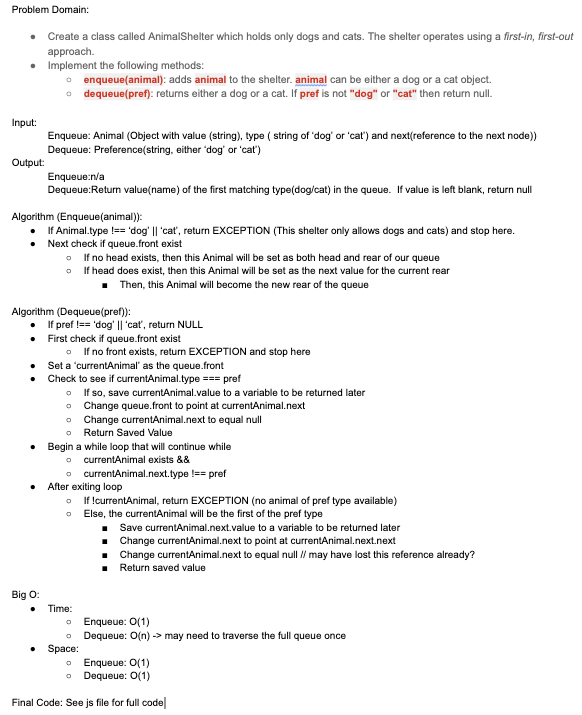

---

# Multi-Bracket Validation
Confirm whether a given string has balanced brackets.

## Challenge

Given a string, return a boolean representing whether or not the brackets in the string are balanced. There are 3 types of brackets:
* Round Brackets : ()
* Square Brackets : []
* Curly Brackets : {}

## Approach & Efficiency

* Establish a new Stack that will hold open brackets.
* Establish a string including all 'Open Bracket' examples
* Begin a for loop that will run at least as long as the length of the provided string, with each loop iterating through a value of i that can be used to reference an index of the provided string.  For each index:
  - If the value at that index is included in the 'Open Bracket' Example, push a new node into the Stack that will hold that value
  - If the value is any one of the three 'Close Bracket' options
    - Check to see if the stack is currently empty.  If it is, this indicates that brackets are out of order 
      - Return false and STOP HERE
    - Peek at the stack 
      - If the top value of the stack is NOT the matching open bracket, this indicates that brackets are out of order 
        - Return false and STOP HERE
      - If the top value of the stack is the matching open bracket, then pop the top value off the stack and continue the loop
* Assuming the loop has completed without a false return, check to see if the Stack is currently empty.
  - If it is, this indicates all brackets were matched.  Return true.
  - If it is not, this indicates that an open bracket was never closed.  Return false.

**Big O**  

* Time: O(n) where n is the length of the string.
* Space: O(n) where n is the length of the string, which will equal the maximum length of the stack that will be created.

## Solution
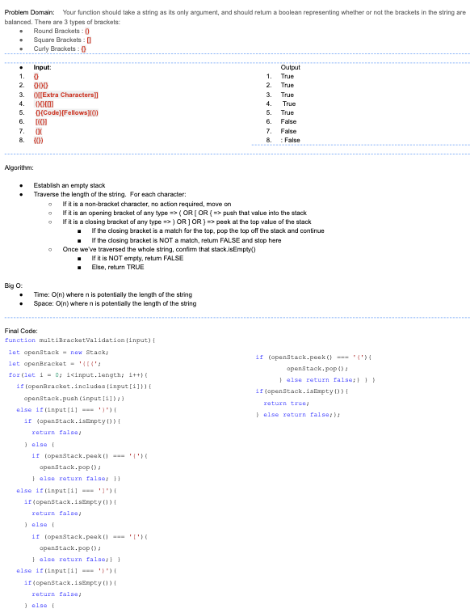

---

# Stacks and Queues
Create a BinaryTree class that contains 3 methods (preOrder(), inOrder() and postOrder()) as well as a BinarySearchTree class that contains 2 methods (add(value) & contains(value)).

## Challenge

* Create a Node class that has properties for the value stored in the node, the left child node, and the right child node.
* Create a BinaryTree class
  - Define a method for each of the depth first traversals called preOrder, inOrder, and postOrder which returns an array of the values, ordered appropriately.
* Any exceptions or errors that come from your code should be semantic, capturable errors. For example, rather than a default error thrown by your language, your code should raise/throw a custom, semantic error that describes what went wrong in calling the methods you wrote for this lab.

* Create a BinarySearchTree class
  - Define a method named add that accepts a value, and adds a new node with that value in the correct location in the binary search tree.
  - Define a method named contains that accepts a value, and returns a boolean indicating whether or not the value is in the tree at least once.

## Approach & Efficiency

The three BinaryTree methods use the same basic mechanics, each traversing the tree in a slightly different order and pushing each value into an array that will be returned.  All methods have an O(n) for time as the full tree must be traversed.  All methods have an O(n) for space where n is the number of nodes in the tree, each of which will add one value to the array that is created and returned.

The Binary Search Tree method of Add traverses the tree beginning at the root and comparing each nodes value to the provided value.  If the provided value is less than the nodes value AND that node does not already have a leftChild, the new node will be created as that nodes leftChild.  If the node already has a leftChild, then the leftChild of the node becomes the new node that the value will be compared to.  This process will continue until the node can be added (with leftChild changed to rightChild in the case of the value being greater than the node value.)  This method has an O(1) for space as one new node will be added to the size of the tree and an O(n) for time, as the worst case scenario would be a fully unbalanced tree that where the new node would be added at the end of the deepest position.

The Binary Search Tree method of Includes traverses the tree in a similar way as Add, but returns a boolean of true If the node value it is considering ever exactly matches the provided value.  If the value does not match and an appropriate child node is not available to move to, this indicates that the value does not exist in the tree and will return a false. 

## API

**BinaryTree Class**

- preOrder() takes no arguments and returns an array with the values of all nodes in the tree, ordered in preOrder (root >> left >> right)

- inOrder() takes no arguments and returns an array with the values of all nodes in the tree, ordered inOrder (left >> root >> right)

- postOrder() takes no arguments and returns an array with the values of all nodes in the tree, ordered in postOrder (left >> right >> root)

**BinarySearchTree Class**

- add(value) accepts a value and adds a new node with that value in the correct location of the binary search tree 

- contains(value) accepts a value as an argument and returns a boolean indicating whether or not the value is in the tree at least once

---

# Find Maximum Value
Given a tree, return the maximum value contained within the tree.

## Challenge

* Write an instance method called find-maximum-value. 
* Without utilizing any of the built-in methods available to your language, return the maximum value stored in the tree. 
  - You can assume that the values stored in the Binary Tree will be numeric.

## Approach & Efficiency

* Confirm that the tree is not empty
  - If it is, throw an error and stop here
* Set an initial value of maxValue equal to this.root.value
*Traverse the full tree using a similar method to any of the earlier traversal methods, *except*
  - Instead of adding each value to an array, compare each value to maxValue
    - If the value is greater than maxValue, reset maxValue to equal the current value
* After traversing the tree, return the final maxValue

**Big O**  

* Time: O(n) where n equals the number of nodes in the given tree.
* Space: O(1) - one value will be held and then returned

## Solution
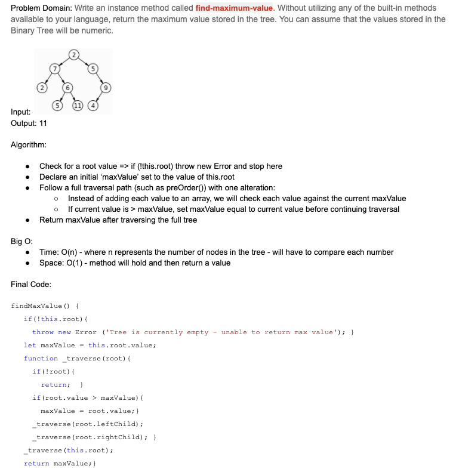

---

# FizzBuzz Tree
Given a tree, change all values that are divisible by 3 & 5 into 'FizzBuzz'. Change all values that are divisible by 3 into 'Fizz'.  Change all values that are divisible by 5 into 'Buzz'.  Change all other values into strings.

## Challenge

* Write a function called FizzBuzzTree which takes a k-ary tree as an argument.
* Without utilizing any of the built-in methods available to your language, determine whether or not the value of each node is divisible by 3, 5 or both. Create a new tree with the same structure as the original, but the values modified as follows:
If the value is divisible by 3, replace the value with “Fizz”
If the value is divisible by 5, replace the value with “Buzz”
If the value is divisible by 3 and 5, replace the value with “FizzBuzz”
If the value is not divisible by 3 or 5, simply turn the number into a String.

## Approach & Efficiency

* Confirm that the tree is not empty
  - If it is, return and stop here
* Enter an altered preOrder traversal beginning at the tree.root.  During the traversal, each node value will be checked
  - If the value is divisible by both 3 & 5, change the value to ‘FizzBuzz’
  - If the value is divisible by 3, but not 5, change the value to ‘Fizz’
  - If the value is divisible by 5, but not 3, change the value to ‘Buzz’
  - If the value is divisible by neither 3 nor 5, change the value to a string

**Big O**  

* Time: O(n) where n equals the number of nodes in the given tree.
* Space: O(1) - the provided tree is changed in place, so no additional space is required

## Solution
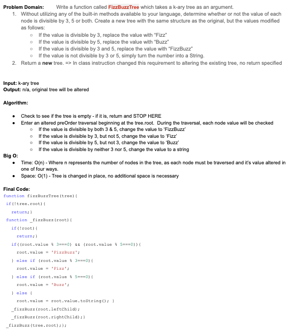

---

# Breadth First Traversal Method - Tree
Extend the Binary Tree class to include a breadth first traversal method that will return all values of the tree in the order of a breadth based traversal.

## Challenge

* Write a breadth first traversal method which takes a Binary Tree as its unique input. Without utilizing any of the built-in methods available to your language, traverse the input tree using a Breadth-first approach, and return a list of the values in the tree in the order they were encountered.

## Approach & Efficiency

* First, confirm that the tree is not empty
  - If it is, stop here (no values to return)
* Declare an output, which will begin as an empty array.
* Declare a new Queue and immediately enqueue the root of the tree that was passed as an argument
* Enter a while loop that will run as long as the queue is not empty
  - Dequeue the first item in the queue and hold the returned value as a reference of formerFront
  - Push the value from the formerFront into the output array
  - Check if the formerFront had a leftChild reference that is not null
    - If it does, enqueue the referenced leftChild node
  - Check if the formerFront had a rightChild reference that is not null
    - If it does, enqueue the referenced rightChild node
* After exiting the while loop (which should indicate that the full tree has been traversed and all nodes considered) return the output array

## API

- breadthFirst() takes a Binary Tree as an argument and returns an array with the values of all nodes in the tree, ordered in breadth first order (Top Down, Left to Right).

## Solution
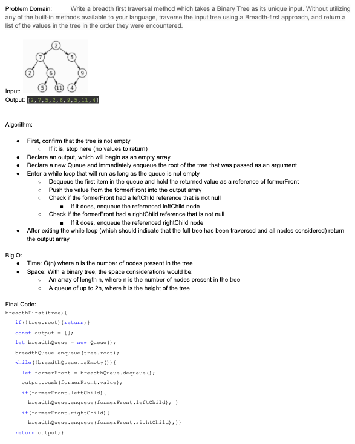

---

# Hash Table
Implement a hash table.

## Challenge

* Implement a Hashtable with the following methods:

  - add: takes in both the key and value. This method should hash the key, and add the key and value pair to the table, handling collisions as needed.
  - get: takes in the key and returns the value from the table.
  - contains: takes in the key and returns a boolean, indicating if the key exists in the table already.
  - hash: takes in an arbitrary key and returns an index in the collection.

## Approach & Efficiency

For this hash table I employed an empty array.  Any time an index is used for storage the first time, a linked list is instantiated at that index position.  All future entries at that same index position will be appended to that linked list.

Space: O(n) - the instantiating array will take up a minimum amount of space equal to an empty array of 1024 positions, additional space will be required as nodes are added for duplicate index entries, but no space requirements grow exponentially.

Time: All methods have a time efficiency of O(n)

  - For the hash method, n is the length of the key string which must be iterated over to create the hash.

  - All remaining methods, n is the number of nodes within a given index.  With an efficiently designed hash table, many of these indexes will have no more than one entry, bringing the efficiency to O(1)

## API

* add(key, value) Take in a key and value.  Add the key/value pair to the table at an index based on a hashed interpretation of the key.  Handle collisions when they happen to allow for multiple entries at the same index point.

* get(key) Take in a key and return the value stored at that key from the table.  If the key does not exist in the table, return null.

* contains(key) Take in a key and return a boolean of true or false based on whether or not the key exists in the table

* hash(key) Take in a key and return an integer between 0 and 1024 to be used as a storage index.  The hashed valued of key must be consistent.

---

# Repeated Word
Return the first repeated word in a given string.

## Challenge

- Write a function that accepts a lengthy string parameter.
- Without utilizing any of the built-in library methods available to your language, return the first word to occur more than once in that provided string.

## Approach & Efficiency

- Break the given string up into individual items in an array (breaking on the spaces)
- Enter into a for loop to examine each word in the new array
  - Normalize each word by changing the string to lowercase and removing any additional markers such as periods and commas (may need to be adjusted/expanded on)
  - Use the hashtable method .contains to see if the given word already exists in the hash table
    - Using the hashtable contains method is more efficent than a typical array.includes method because only the hashed key index needs to be checked rather than all possible entries
  - If check returns true, return the word and Stop Here
  - Else, add the word (as both key and value) to the table and continue with the for loop
  - If no match is ever found and the for loop ends, throw an error that there was no repetition present.

**Big O**  

* Time: O(n) worst case scenario involves no repeated words, in which case each word in the string would need to be checked for inclusion and then added to the hash table.
* Space: O(n) where n = the number of words in the initial string (which would be duplicated once in the initial array and again in the hash table)

## Solution
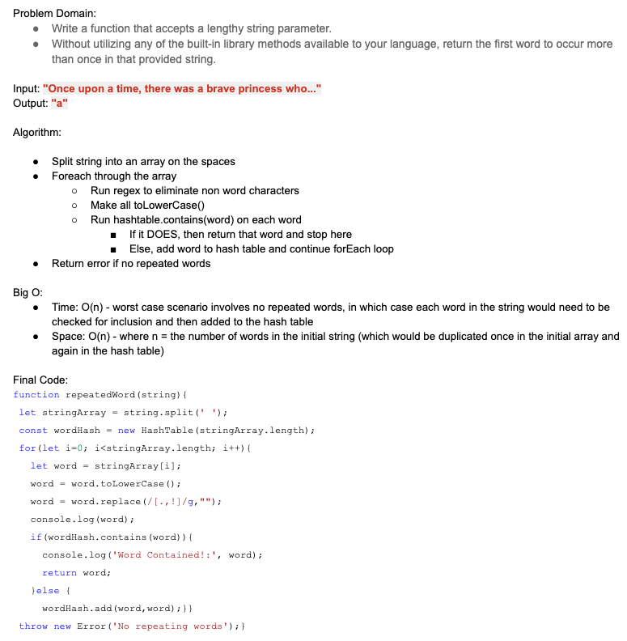

---

# Tree Intersection
Return a set of values present in both provided trees.

## Challenge

- Write a function called tree_intersection that takes two binary tree parameters.
- Without utilizing any of the built-in library methods available to your language, return a set of values found in both trees.

## Approach & Efficiency

- Given two trees as inputs, we can run a traversal of each to return two arrays, each representing all values within one tree
- Then, we can add all values of tree A to a hash table
- Do a .contains(key) check of each value from tree B
  - If TRUE, add to a new Return Array
- Return the new Return Array containing all (and only) repeated values

**Big O**  

* Time: O(n)* => Binary Tree traversals and adding to a hash table each take O(n) where n = each value/node interacted with once.  The final contains check should be a constant O(1) unless values become deeply nested in the table due to a bad hash.
* Space: O(n) => more precisely, something closer to O(4n) as we’ll be creating 3 new arrays (one for each tree and one for duplicate values to be returned) as well as a hash table containing all the values from one of the trees.

## Solution
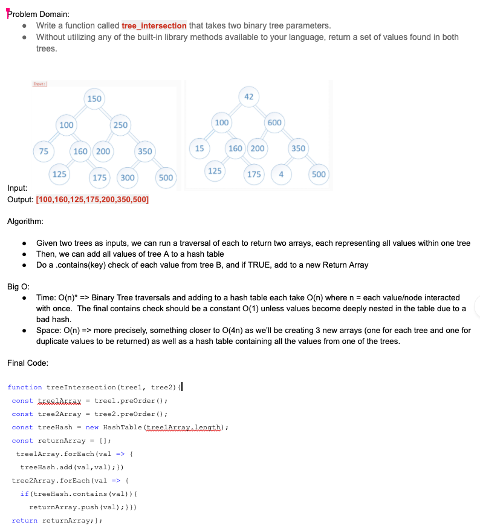

---

# Left Join
Implement a simplified LEFT JOIN for 2 Hashmaps.

## Challenge

- Write a function that LEFT JOINs two hashmaps into a single data structure.
- The first parameter is a hashmap that has word strings as keys, and a synonym of the key as values.
- The second parameter is a hashmap that has word strings as keys, and antonyms of the key as values.
- Combine the key and corresponding values (if they exist) into a new data structure according to LEFT JOIN logic.
- LEFT JOIN means all the values in the first hashmap are returned, and if values exist in the “right” hashmap, they are appended to the result row. If no values exist in the right hashmap, then some flavor of NULL should be appended to the result row.
- The returned data structure that holds the results is up to you. It doesn’t need to exactly match the output below, so long as it achieves the LEFT JOIN logic.
- Avoid utilizing any of the library methods available to your language

## Approach & Efficiency

- Identify all keys present in the left table
  - Use Object.entries() to retrieve all key/value pairs present in the left table
- For each key =>
  - IF key is present in the right table
    - Add the value from the right table to the key’s array
    - ELSE add NULL
- Return the output array

**Big O**  

* Time: O(n) where n = key/value pairs in the left table
* Space: O(n) where n = 3x the keys in the left table (number of data points that will be held in the newly created array)

## Solution
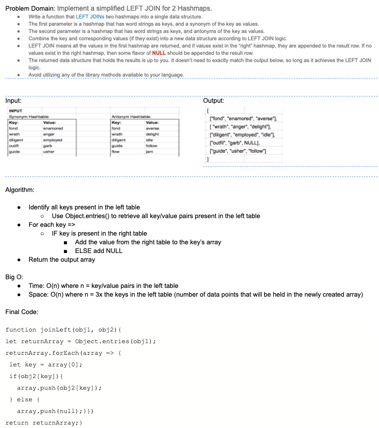

---

# Graph
Implement a graph.

## Challenge

* Implement your own Graph. The graph should be represented as an adjacency list, and should include the following methods:

- AddNode()
  - Adds a new node to the graph
  - Takes in the value of that node
  - Returns the added node
- AddEdge()
  - Adds a new edge between two nodes in the graph
  - Include the ability to have a “weight”
  - Takes in the two nodes to be connected by the edge
    - Both nodes should already be in the Graph
- GetNodes()
  - Returns all of the nodes in the graph as a collection (set, list, or similar)
- GetNeighbors()
  - Returns a collection of edges connected to the given node
  - Takes in a given node
  - Include the weight of the connection in the returned collection
- Size()
  - Returns the total number of nodes in the graph

## Approach & Efficiency

TBD

## API

* addNode(node) Take in a node.  Create a node with the value of the provided node.  Add the newly created node to the graph, and return the added node.

* addEdge(origin, destination, weight) Take in two nodes already added to the graph as well as an optional weight.  Create an edge between the two nodes that includes weight.  Add the edge reference to both nodes involved.

* getNodes() Return all nodes in the graph as a collection

* getNeighbors(node) Take in a node.  Return a collection of edges connected to the given node, including weight if available.

* size() Return the number of nodes in the graph

--

# Breadth First Traversal Method - Graph
Implement a breadth-first traversal on a graph.

## Challenge

* Extend your graph object with a breadth-first traversal method that accepts a starting node. Without utilizing any of the built-in methods available to your language, return a collection of nodes in the order they were visited. Display the collection.

## Approach & Efficiency

* Declare a target node
  - Locate the node in the graph that matches the value of the node, and set the target node equal to *that* node
* Declare an empty Return Set to hold values throughout the traversal
* Declare a new Queue
  - Enqueue the target node as a starting point for the traversal
* Begin a while loop that will continue *while* the queue is not empty
  - Dequeue the front node from the queue and set it equal to a holding variable (formerFront)
  - Add the value of the formerFront to the Return Set
  - For each neighbor of the formerFront:
    - Check if the value of the origin node is in the Return Set.
      - If it is *not*, enqueue the node & add the value to the Return Set
    - Check if the value of the destination node is in the Return Set.
      - If it is *not*, enqueue the node & add the value to the Return Set
* Return the Return Set

## API

- bfTraversal() takes a node from a graph as an argument and returns a Set with the values of all nodes in the Graph, ordered in breadth first order.
